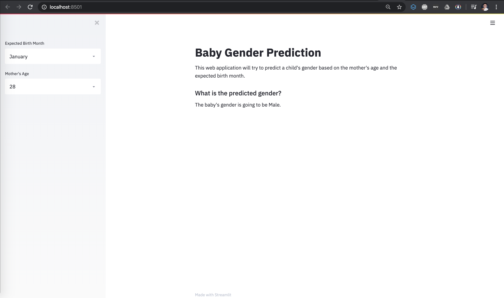

# Baby Gender Predictor Web Application
Author: Xavier M. Puspus

### Description

[Click this link to explore the web application hosted in Heroku.](https://gender-predictor.herokuapp.com/)  


I used a chinese gender predictor reference table to build this web application that predicts gender based on your mother's age and the expected birth month.


### Deployment Through Web Application

I used the most recently released API of [Streamlit](https://streamlit.io) to deploy the ml model and locally serve the web app.

### Running the App

In order to run the app, you must have the basic data science packages available on your machine, (`pandas`, `numpy`) and install streamlit using:  

```console
foo@bar:~$ pip install streamlit
```

Checkout the `requirements.txt` file for installation specs. You can install packages needed for this repo through:

```console
foo@bar:~$ pip install -r requirements.txt
```

Afterwards, `cd` into the directory of `app.py` and run this on the terminal:  

```console
foo@bar:~$ streamlit run app.py
```

### Display

The web app should look something like this:

